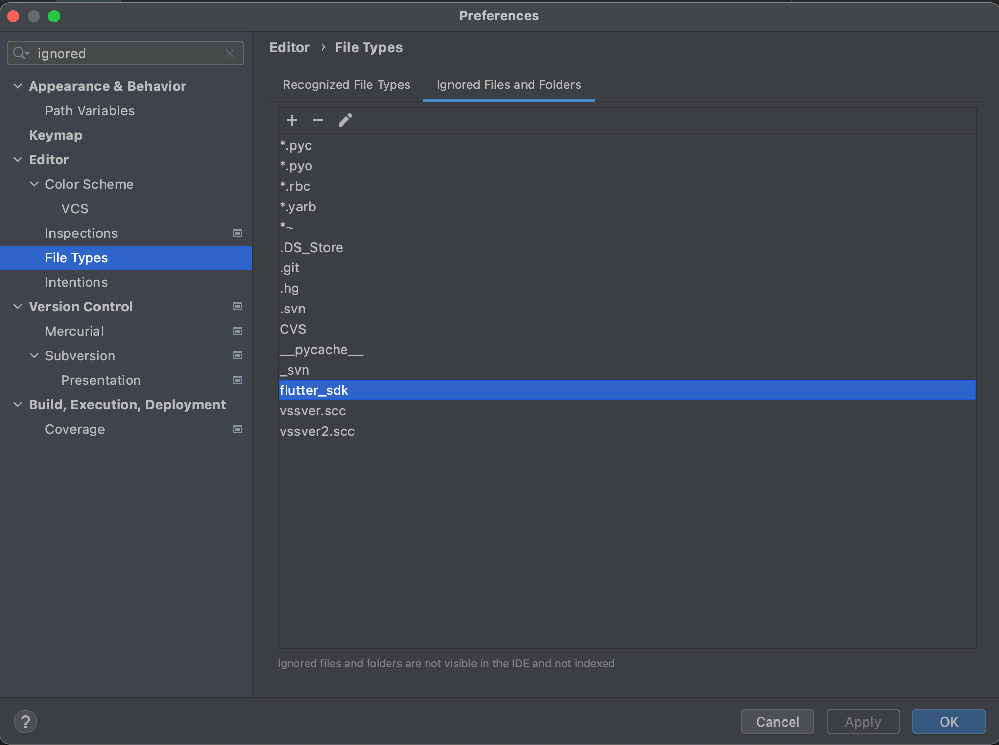

Read this guide to learn how to use fvm with any IntelliJ-based IDE, like Android Studio.
This guide will from now on write IntelliJ only.

Please note, that you need to do this per project.

:::info
Before proceeding, make sure, you've run `fvm use` with a specific version or channel in your project.
Otherwise you cannot setup the IntelliJ integration.
:::

## Update IntelliJ Settings

1. In IntelliJ go to `Languages & Frameworks > Flutter` or search for Flutter and change Flutter SDK path.
2. Copy the **_absolute_** path of fvm symbolic link in your root project directory. Example: `/absolute-project-path/.fvm/flutter_sdk`
3. Apply the changes.

### Symlink path

Due to `.fvm/flutter_sdk` being a symlink, IntelliJ may visually change the value of the path to the absolute path whereever the symlink does point to.
As long as you leave the path untouched, it should work as expected.

Please run `fvm doctor` in your project and find `IntelliJ > SDK Path`. 
It will show an information, if something has not been setup correctly.

:::important SDK change
If you're changing the SDK via `fvm use` it may take IntelliJ some seconds to notice the change.

If it does not recognize it after some seconds or after a restart, please run `fvm doctor` in your project's directory.
Find `IntelliJ > SDK Path`. 
It will show an information, if something has not been setup correctly.
:::

## Ignore Flutter SDK root

If you want to ignore the Flutter SDK root directory within IntelliJ you can add the following to `.idea/workspace.xml`.

```xml
<component name="VcsManagerConfiguration">
  <ignored-roots>
    <path value="$PROJECT_DIR$/.fvm/flutter_sdk" />
  </ignored-roots>
</component>
...
```

If that doesn't work, go to IntelliJ -> Preferences -> Editor -> File Types -> Ignored Files and Folders and add `flutter_sdk`:


## Troubleshooting

### IntelliJ is not changing the SDK then using `fvm use`

If you setup IntelliJ like described above and it does not change the SDK when using `fvm use`,
open the file `.idea/libraries/Dart_SDK.xml` in your project's root directory.

Within this file, you should check, if all paths contain `$PROJECT_DIR$/.fvm/flutter_sdk`.
If so, then the setup should be correct and you may should restart IntelliJ.

If it is not the case, the setup was not correct.
Now, select any other Flutter version you have available. 
Using one from `fvm` is ok, as long as you point to it directly, not via the `.fvm/flutter_sdk` symlink.
After selecting any other version, `Apply` the changes in IntelliJ.
After that, select `.fvm/flutter_sdk` again and `Apply` the changes.

Now, everything should work as expected.

If nothing has helped, please see [this issue](https://github.com/leoafarias/fvm/issues/310#issuecomment-1822660953) for more insights.